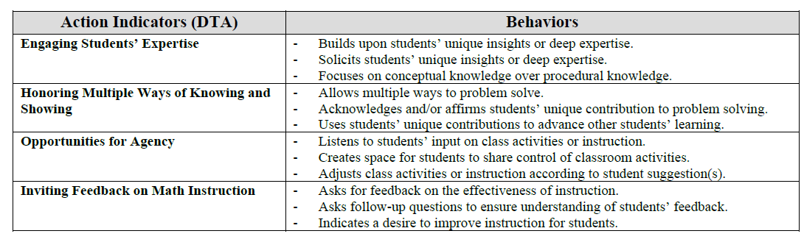

# Multimodal-Transcription-BCI-AIED26

This repository contains the implementation and prompt design for the multimodal transcription and a multi-agent system that identifies classroom interactions aligned with Belonging-Centered Instruction (BCI).

## Overview
- Multimodal transcription powered by Gemini
- 4-agent pipeline:
  - Triggering Utterance Spotter
  - Event Generator
  - Event Coder
  - Event Scorer

## Prompt Design of BCI Multi-Agent System
All agents follow a structured prompt design:
1. Role and goal
2. Input
3. Core instructions and process
4. Important reminders

See full details:
→ docs/prompt_design_description.pdf

## Protocol
The BCI protocol defines:
- Action indicators
- Behavior sets
- Scoring rubrics
- Exemplars

## Protocol Subdimension: Decentering Teacher Authority
For BCI-AI paper published in AIED 2026, we focused on Decentering Teacher Authority

  

## Transcription Evaluation

For the **ClassBank dataset**, we used the professionally produced reference transcripts distributed with the repository.

For the **BCI videos**, ground-truth transcripts were constructed through human review and correction of AI-generated transcripts. Annotators marked segments that could not be confidently verified using a `[Hard to check]` tag; these segments were excluded from evaluation.

The evaluation of transcription error types (as defined in Table 1 of the paper) was conducted **only for the BCI dataset**, as these error annotations require manual human labeling and are not available in the ClassBank reference transcripts.

## Normalization Procedure

To ensure fair comparison across transcription methods for word recognition accuracy, all transcripts underwent identical normalization procedures:

- Conversion to lowercase  
- Removal of timestamps and speaker labels  
- Removal of special markers (e.g., `[Unintelligible]`, `[Inaudible]`, `[Hard to check]`)  
- Removal of visual descriptions from multimodal transcripts (e.g., `(Visual: ...)`)  
- Removal of punctuation *(apostrophes in contractions are preserved)*  
- Whitespace normalization  

## Notes

- Error type evaluation is **BCI-only**  
- Normalization is applied **consistently across all methods**
